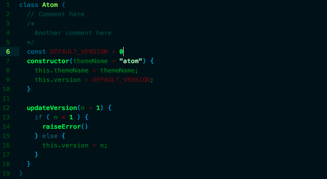
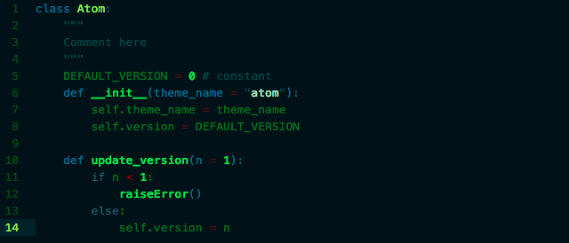
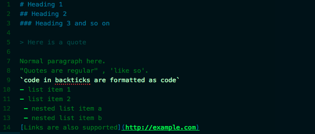

# Terminate-syntax theme

> See snapshots below to see what Terminate looks like

An adaptation of Apple's green default Terminal settings with a touch of blues, yellows and red to contrast important syntax like function calls, constants, strings, operators and comments while keeping a central color scheme.

#### Javascript

#### ruby

#### Python

#### Markdown

#### JSON

#### HTMl (*coming soon*)
#### CSS (*coming soon*)

## Idea behind Terminate:
- Old school feel of bright green font with a dark background.
- Contrasting colors to allow important operations/code to 'pop out' from the dark background and other code that isn't as important.
 - Comments are dark and closely colored to the background to remove their importance of interpreted code
 - Function calls are brightened to show where in your code they're being called at
 - Constants are bright red and important operations (arithmetic and comparisons) are dark red
 - Strings are very light hue of the main green font color. This color is near opposite of comments and are easily seen.
- Syntax UI to fit any language (see below for language support)
- Search results are outlined in bright red

## Color Scheme
- Main text color- lime green
- Background color- dark teal (near black)
- Supporting colors- dark green, pale lime, teal and blue
- Comment color- lightened shade of background color
- String color- bright white shade of main text color
- Constants and operations color- from dark to normal red

## Language Support
**Terminate** *should* display nicely with most common languages. If not open an issue and I'll fix it (I'm also open to pull-requests. See below for more information). I've tested Terminate with the following languages:
- Markdown
- Python
- Ruby
- Javascript &amp; JSON
- HTML &amp; CSS (LESS, SASS)
- [Elixir](http://elixir-lang.org)

## Pull Requests
Gladly accepting pull-requests. First open an issue if one hasn't been opened already and let's discuss changes. I'd like help to work with other languages that I am not familiar. Those would be any languages I have not supported above. Thank you!

## Todo:
- edit any `@red` attributes- I did this to note that I need to fix these. So in a language if there is an odd red syntax it's probably an attribute that hasn't been intentionally set yet.
- HTML- make color of 'class' attributes match 'id'
- Language-specific
  - Python- fix color for constants. Not showing highlighted as red
  - Ruby- fix color of function calls. Not showing as highlighted neon-green
